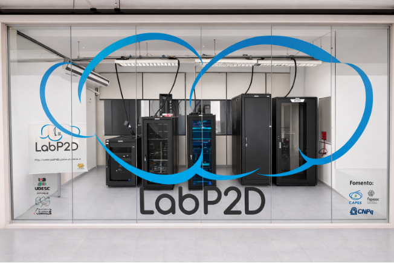

# Baia da Babitonga

Lista de recursos de Computação de Alto Desempenho da **Baia da Babitonga** mantida pelo LabP2D.

> **Nota:** Este README segue a mesma organização do README do CMU, adaptado para a Baia da Babitonga.

📖 **Manual do Usuário**

Clique na imagem abaixo.

[](Agregado-HPC_BaiaDaBabitonga.pdf)

---

## Sumário

- [Frontend](#frontend)
- [Baia-1](#baia-1)
- [Baia-2](#baia-2)
- [Baia-3](#baia-3)
- [Baia-4](#baia-4)
- [Baia-5](#baia-5)
- [Baia-6](#baia-6)
- [Baia-7](#baia-7)

---

# Frontend

Ponto de acesso ao cluster Babitonga.

Principais serviços:

- SLURM
- Diretórios de projetos (`/mnt/prj`)
- Scratch compartilhado

---

# Baia-1

## Sistema

- Ubuntu Server 22.04 LTS
- Kernel 5.15

## CPU

- Intel Core i7-13700K
- 16 núcleos (24 threads)

## GPU

- NVIDIA RTX A4000 (12 GB)

## Memória

- 64 GB DDR5

## Armazenamento

- SSD NVMe SK hynix 512 GB

---

# Baia-2

Mesmo hardware da Baia-1.

---

# Baia-3

Mesmo hardware da Baia-1.

---

# Baia-4

Mesmo hardware da Baia-1.

---

# Baia-5

Mesmo hardware da Baia-1.

---

# Baia-6

Mesmo hardware da Baia-1.

---

# Baia-7

Mesmo hardware da Baia-1.

---

## Características gerais

- 7 nós de computação
- Intel Core i7-13700K em todos os nós
- 64 GB RAM por nó
- NVIDIA RTX A4000 por nó
- Ubuntu Server 22.04 LTS
- SLURM Workload Manager

## Documentação

- `docs/Agregado-HPC_BaiaDaBabitonga.pdf`

## Foto

Coloque a foto da baia no repositório, por exemplo:

```
img/babitonga.jpg
```
